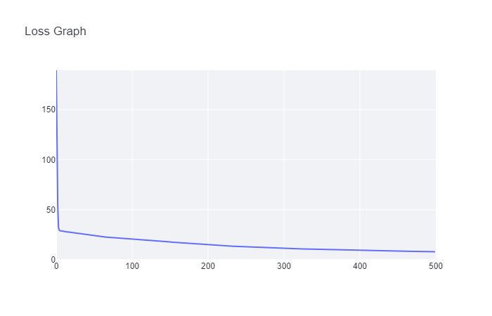

[](https://classroom.github.com/online_ide?assignment_repo_id=15359881&assignment_repo_type=AssignmentRepo)
# MiniTorch Module 2


* Docs: https://minitorch.github.io/

* Overview: https://minitorch.github.io/module2/module2/

This assignment requires the following files from the previous assignments. You can get these by running

```bash
python sync_previous_module.py previous-module-dir current-module-dir
```

The files that will be synced are:

        minitorch/operators.py minitorch/module.py minitorch/autodiff.py minitorch/scalar.py minitorch/module.py project/run_manual.py project/run_scalar.py

# Results for training

## Dataset : Simple
Hyperparameter: Num of layers = 4, Learning rate = 0.05
Time per epoch: 0.36


## Dataset : Diag
Hyperparameter: Num of layers = 4, Learning rate = 0.05
Time per epoch: 0.763s


## Dataset : Split
Hyperparameter: Num of layers = 16, Learning rate = 0.05
Time per epoch: 2.335s



## Dataset : Xor
Hyperparameter: Num of layers = 16, Learning rate = 0.05
Time per epoch: 2.366s


## Dataset : Circle
Hyperparameter: Num of layers = 12, Learning rate = 0.1
Time per epoch: 1.498s


<!-- 
## Dataset : Spiral
Hyperparameter: Num of layers = 12, Learning rate = 0.1
Time per epoch: 

 -->